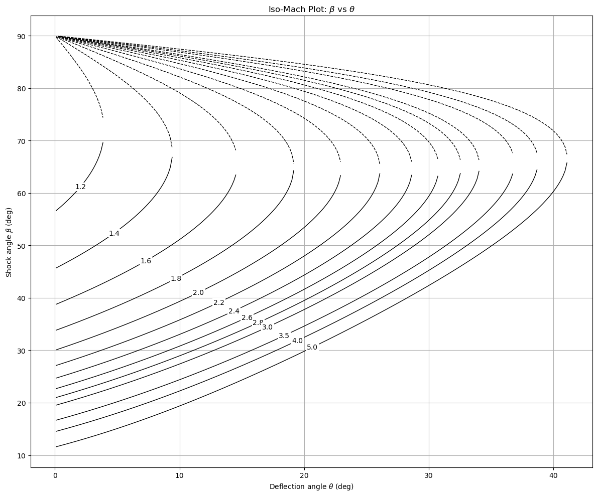
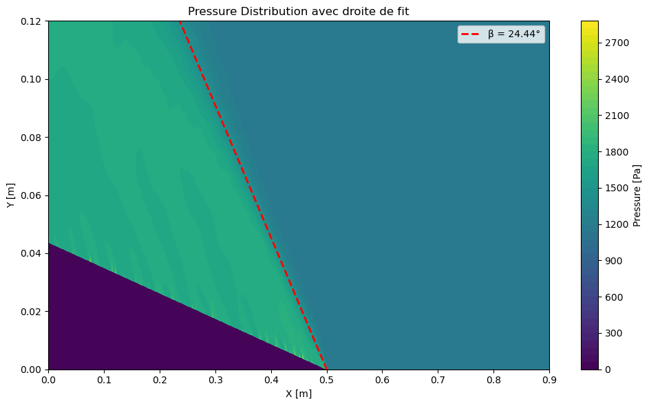
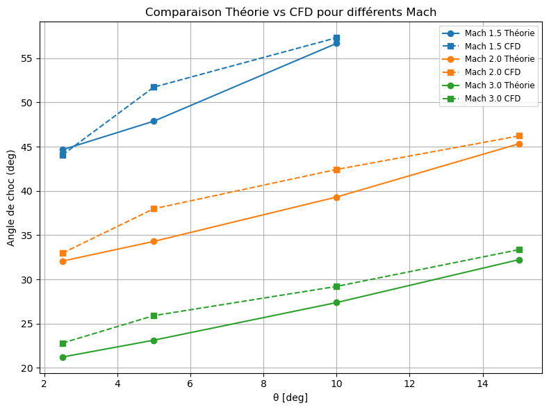

# Oblique Shock Angle Analysis

This repository provides a comprehensive study of oblique shock angles over a wedge-like slope, combining analytical, numerical, and CFD approaches. The project includes:

- **Theoretical derivation** of oblique-shock relations and small-disturbance approximations.
- **Numerical solution** via a bisection method implemented in Python to compute shock angles for given deflection angles and Mach numbers.
- **CFD simulations** using SolidWorks Flow Simulation (CFD NIKA) to validate theoretical predictions, including pressure field computation, K-Means clustering, and linear fitting of shock boundaries.

## Prerequisites

- **Python 3.8+** with the following packages:
  - numpy
  - matplotlib
  - scikit-learn
  - pandas (for data handling)

- **SolidWorks Flow Simulation** with access to the CFD NIKA solver for running CFD cases and exporting results.

## Key Figures

### Numerical vs. Published Polar

### Final Shock Angle Extraction from CFD

### Comparaison Numerical / CFD

---

## Conclusion

The numerical and CFD approaches agree within 12% across all test cases, validating the theoretical oblique-shock relations. CFD becomes particularly valuable when thermal coupling or unsteady phenomena are present, where the inviscid, steady assumptions of classical theory no longer suffice.

---

## License

This project is released under the MIT License. See [LICENSE](LICENSE) for details.
